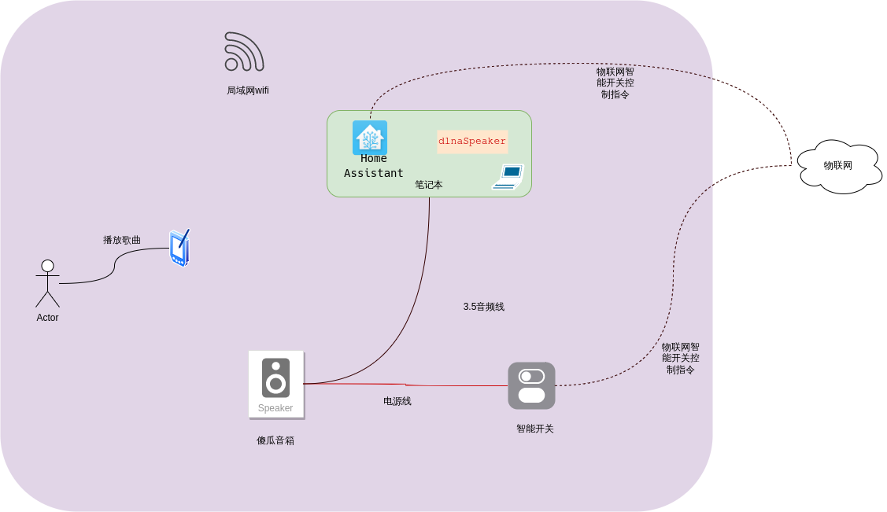

# 概述
`dlnaSpeaker`可以模拟成一个DMR设备，让局域网内的设备通过UPnP协议自动发现。

# 背景

近期对单片机esp32、esp8266 比较着迷。想把家里所有的电子设备都变成智能的设备。

家里面有一台傻瓜音箱（给电就运行的那种），试着想把它改成智能的，比如说：我要听歌曲的时候就自动打开电源，并播放手机里面的歌曲。

所以要实现这个场景要做到如下几点：

* 自动打开电源： 则可以利用 [Home Assistant](https://www.home-assistant.io/)自动化打开电源
* 播放手机里面的歌曲： 可以利用DLNA这一功能。
* 信息同步： 播放歌曲时自动打开电源。每当手机投屏时，利用webhook的机制调用`Home Assistant`将电源打开
* 播放：使用mpv播放器，因此前提要安装好mpv播放器

> 实力雄厚的大佬可以忽略


# 感谢
[`Macast`](https://github.com/xfangfang/Macast)： DMR python的实现。参考了里面大部分功能

[`blang/mpv`](github.com/blang/mpv)： mpv播放器Golang的轮子

# 命令行
```shell
./dlnaSpeaker -h               
Usage of ./dlna:
  -hook string
        指定webhook地址
  -i string
        指定网卡 (default "wlo1")
  -n string
        指定音箱名字 (default "DLNA音箱")
  -p int
        指定端口 (default 4564)

```
# 示意图

